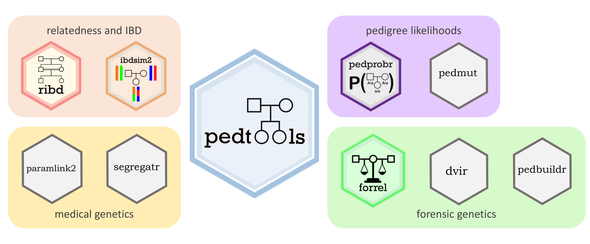

<!-- README.md is generated from README.Rmd. Please edit that file -->

# The **ped suite**: R packages for pedigree analysis

<!-- badges: start -->
<!-- badges: end -->

The **ped suite** is a collection of R packages for pedigree analysis,
covering a variety of applications across several fields. The packages
are designed to work harmoniously together, often allowing complex tasks
to be solved in a few lines of code.

#### Core packages

At the centre of the **ped suite** we find the package **pedtools**, on
which all the others depend. In addition, several packages contain basic
features often needed in many types of analysis. These are the *core*
packages:

-   [pedtools](https://github.com/magnusdv/pedtools): Creating and
    working with pedigrees and marker data
-   [ribd](https://github.com/magnusdv/ribd): Computation of
    pedigree-based relatedness coefficients
-   [pedprobr](https://github.com/magnusdv/pedprobr): Marker
    probabilities and pedigree likelihoods
-   [pedmut](https://github.com/magnusdv/pedmut): Mutation models for
    pedigree likelihood computations
-   [forrel](https://github.com/magnusdv/forrel): Forensic pedigree
    analysis and relatedness analysis

#### Specialised packages

The following packages are devoted to special applications:

-   [ibdsim2](https://github.com/magnusdv/ibdsim2): Simulation of
    identity-by-descent sharing by family members
-   [dvir](https://github.com/thoree/dvir): Disaster victim
    identification
-   [pedbuildr](https://github.com/magnusdv/pedbuildr): Pedigree
    reconstruction
-   [paramlink2](https://github.com/magnusdv/paramlink2): Parametric
    linkage analysis
-   [segregatr](https://github.com/magnusdv/segregatr): Segregation
    analysis for clinical variant interpretation

#### Retired packages

These packages have been superseded by other packages and are no longer
compatible with the rest of the **ped suite**. They are maintained only
for legacy purposes and should not be used in new projects.

-   [paramlink](https://CRAN.R-project.org/package=paramlink): This
    package marked the birth of the **ped suite**. Originally intended
    for parametric linkage analysis, it also contained the seeds of the
    current packages **pedtools**, **pedprobr**, **ribd** and
    **forrel**.
-   [IBDsim](https://CRAN.R-project.org/package=IBDsim): This is
    replaced by **ibdsim2**. (Regrettably, the name ‘IBDsim’ is very
    similar to that of the unrelated (non-R) software ‘IBDSim’
    ([Leblois, Estoup &
    Rousset](http://www1.montpellier.inra.fr/CBGP/software/ibdsim/index.html)).)

#### Imported packages

-   [kinship2](https://CRAN.R-project.org/package=IBDsim): All pedigree
    plots in the **ped suite** are internally made with the very nice
    **kinship2** package ([Sinnwell, Therneau &
    Schaid](https://doi.org/10.1159/000363105)). Creating nice pedigree
    plots is a highly non-trivial matter, so if you use the **ped
    suite** to create pedigree plots for publications, please also
    credit **kinship2**.

## QuickPed

In addition to the R packages, the **ped suite** also includes the
online pedigree creator
[QuickPed](https://magnusdv.github.io/pedsuite/articles/web_only/.quickped.html).
Read more about it by clicking the previous link, or simply try it out
here: <https://magnusdv.shinyapps.io/quickped>.
