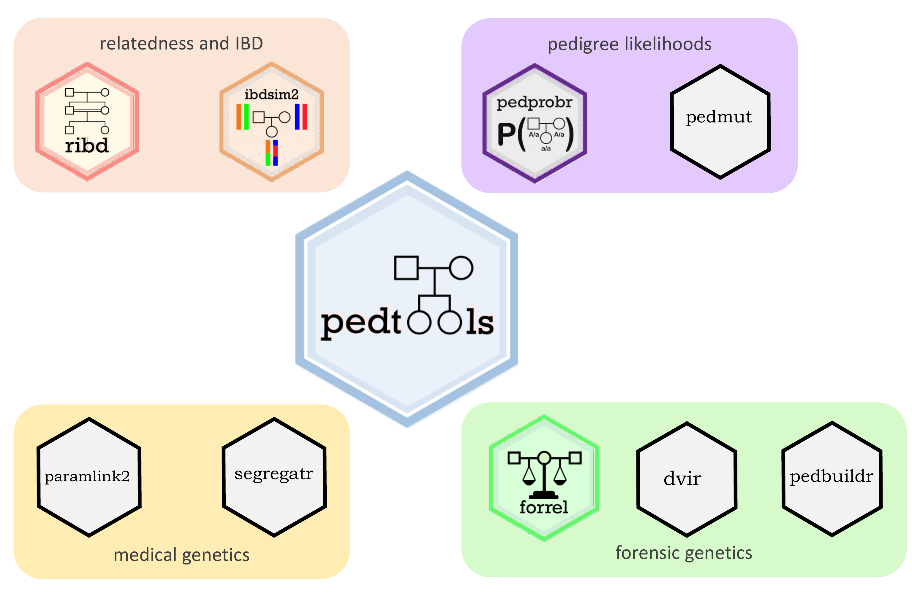

<!-- README.md is generated from README.Rmd. Please edit that file -->

# ped suite

<!-- badges: start -->
<!-- badges: end -->

The **ped suite** is a collection of R packages for pedigree analysis,
covering a variety of applications across several fields. The packages
are designed to work harmoniously together, often allowing complex tasks
to be solved in a few lines of code.

The following picture gives an overview of how the **ped suite** is
organised. At the center we find the **pedtools** package, on which all
the others depend.



#### Core packages

The following packages are the most common, and frequently used by other
**ped suite** packages. They are all automatically attached by the
command `library(pedsuite)`.

-   [pedtools](https://github.com/magnusdv/pedtools): Creating and
    working with pedigrees and marker data
-   [ribd](https://github.com/magnusdv/ribd): Computation of
    pedigree-based relatedness coefficients
-   [pedprobr](https://github.com/magnusdv/pedprobr): Marker
    probabilities and pedigree likelihoods
-   [pedmut](https://github.com/magnusdv/pedmut): Mutation models for
    pedigree likelihood computations
-   [forrel](https://github.com/magnusdv/forrel): Forensic pedigree
    analysis and relatedness analysis

#### Specialised packages

The following packages are devoted to special applications:

-   [ibdsim2](https://github.com/magnusdv/ibdsim2): Simulation of
    identity-by-descent sharing by family members
-   [dvir](https://github.com/thoree/dvir): Disaster victim
    identification
-   [pedbuildr](https://github.com/magnusdv/pedbuildr): Pedigree
    reconstruction
-   [paramlink2](https://github.com/magnusdv/paramlink2): Parametric
    linkage analysis
-   [segregatr](https://github.com/magnusdv/segregatr): Segregation
    analysis for clinical variant interpretation

# Book

The book *Pedigree Analysis in R* (Academic Press, 2021) is based on the
**ped suite** and contains detailed explanations and examples of how to
use the different packages.


<br/> Check it out at
<https://www.elsevier.com/books/pedigree-analysis-in-r/vigeland/978-0-12-824430-2>.

## Installation

You can install **pedsuite** from
[GitHub](https://github.com/magnusdv/pedsuite) with:

``` r
# install.packages("devtools")
devtools::install_github("magnusdv/pedsuite")
```
