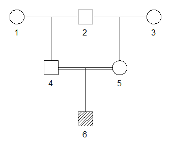
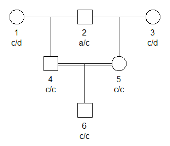

<!-- README.md is generated from README.Rmd. Please edit that file -->

# pedsuite

<!-- badges: start -->
<!-- badges: end -->

The **pedsuite** package is a meta-package simplifying the installation
and use of the `ped suite`, a collection of packages for pedigree
analysis.

## Installation

You can install **pedsuite** from [GitHub](https://github.com/) with:

``` r
# install.packages("devtools")
devtools::install_github("magnusdv/pedsuite")
```

## Example

``` r
library(pedsuite)
#> Loading required package: forrel
#> Loading required package: pedtools
#> Loading required package: pedmut
#> Loading required package: pedprobr
#> Loading required package: ribd
```

We now have access to all the functions of **pedtools** and the other
`ped suite` packages.

``` r
# Create pedigree
x = halfSibPed(sex1 = 1, sex2 = 2)
x = addChildren(x, father = 4, mother = 5)

# Plot it
plot(x, hatched = 6, margins = c(1,1,1,1))
```



Calculate the inbreeding coefficient of the child (with
`ribd::inbreeding()`):

``` r
inbreeding(x, ids = 6)
#> [1] 0.125
```

Simulate genotypes for a single marker with alleles `a`, `b`, `c`, `d`
(with `forrel::markerSim()`):

``` r
y = markerSim(x, N = 1, alleles = c("a", "b", "c", "d"), seed = 1729)
#> Unconditional simulation of 1 autosomal marker.
#> Individuals: 1, 2, 3, 4, 5, 6
#> Allele frequencies:
#>     a    b    c    d
#>  0.25 0.25 0.25 0.25
#> Mutation model: No 
#> 
#> Simulation finished.
#> Calls to `likelihood()`: 0.
#> Total time used: 0.14 seconds.
```

And plot the result:

``` r
plot(y, marker = 1, margins = c(1,1,1,1))
```


