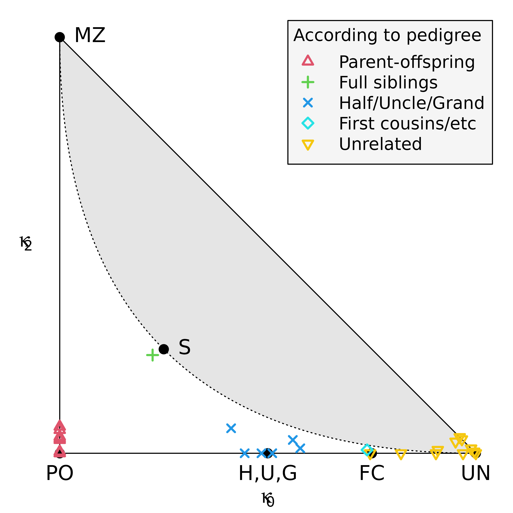

# Getting started with the pedsuite

## Installation

The following command installs the latest official versions of the
**pedsuite** packages:

``` r
install.packages("pedsuite")
```

Alternatively, you can install the development versions from GitHub:

``` r
# install.packages("devtools")
devtools::install_github("magnusdv/pedsuite")
```

If you only need a few of the packages, you may choose to install them
individually instead of the entire collection.

------------------------------------------------------------------------

## A quick tour

The aim of this vignette is to illustrate a few of the possibilities of
the **pedsuite** packages. It should be noted that we are barely
scratching the surface here; in particular several packages are not even
mentioned. For a more comprehensive overview, I recommend the
[book](https://magnusdv.github.io/pedsuite/articles/web_only/publications.html#book).

To get started we load the **pedsuite** package, which is a convenient
shortcut for loading all the [core
packages](https://magnusdv.github.io/pedsuite/#core-packages), making
their methods available in the current R session.

``` r
library(pedsuite)
#> Loading required package: forrel
#> Loading required package: pedtools
#> Loading required package: pedprobr
#> Loading required package: ribd
#> Loading required package: verbalisr
```

### 1. Create a pedigree (**pedtools**)

We begin by creating and plotting a pedigree with a child of first
cousins:

``` r
x = cousinPed(1, child = TRUE)
plot(x)
```


For symmetry let us change the sex of individual 3. We also take the
opportunity to showcase some of the plot options (many more are
available - see the help page by typing
[`?plotmethods`](https://magnusdv.github.io/pedsuite/reference/plotmethods.html)):

``` r
x = swapSex(x, ids = 3)
#> Changing sex of spouses as well: 4

plot(x, 
     hatched = 9, 
     carrier = 7:8,
     fill = list(pink = 1), 
     textAnnot = list(inside = c("1" = "?")))
```


### 2. Calculate the inbreeding coefficient (**ribd**)

The inbreeding coefficient $f$ of a pedigree member is defined as the
probability of *autozygosity* at a random autosomal locus. That is, the
probability that the two homologous alleles have the same origin within
the pedigree.

For a child of first cousins one can work out by pen and paper that
$f = 1/16$. Alternatively, we can calculate it with the **ribd**
function
[`inbreeding()`](https://magnusdv.github.io/pedsuite/reference/inbreeding.html).

``` r
inbreeding(x, ids = 9)
#> [1] 0.0625
```

The output agrees with $f = 1/16$.

### 3. Realised inbreeding (**ibdsim2**)

For any particular child of first cousins, the actual autozygous
fraction of the genome (except X & Y) is called the coefficient of
*realised inbreeding*, denoted $f_{R}$. This may deviate substantially
from the pedigree-based expectation $f = 1/16$.

We can simulate the distribution of $f_{R}$ with the **ibdsim2**
package. Since this is not a core package we must load it separately.

``` r
library(ibdsim2)
```

First, we use the function
[`ibdsim()`](https://magnusdv.github.io/pedsuite/reference/ibdsim.html)
to simulate the recombination process in the entire pedigree, 200 times:

``` r
sims = ibdsim(x, N = 200, seed = 123)
#> Simulation parameters:
#> Simulations  : 200
#> Chromosomes  : 1-22
#> Genome length: 2875 Mb
#>                2602.29 cM (male)
#>                4180.42 cM (female)
#> Recomb model : chi
#> Target indivs: 1-9
#> Skip recomb  : -
#> Total time used: 1.91 secs
```

Now extract the autozygous segments of each simulation.

``` r
fr = realisedInbreeding(sims, id = 9)
```

Here is a summary of the first 6 simulations, including the number of
segments and various length statistics:

``` r
head(fr$perSimulation)
#>   nSeg  meanLen   totLen   maxLen    minLen      fReal
#> 1   11 19.04942 209.5437 37.56569 0.8072431 0.06178760
#> 2   12 14.17475 170.0970 48.43677 1.3413298 0.05015605
#> 3   12 12.87744 154.5293 26.11588 0.1475564 0.04556565
#> 4   19 17.43950 331.3506 58.64604 1.2084099 0.09770450
#> 5   16 16.96611 271.4577 44.94334 1.0386058 0.08004404
#> 6   13 17.84722 232.0139 49.91368 0.9532618 0.06841334
```

And here is a histogram of the realised inbreeding coefficients (given
in the right-most column above):

``` r
hist(fr$perSimulation$fReal, xlim = c(0, 0.15), breaks = 16, xlab = "f_R", main = NULL)

# Expected value
abline(v = 1/16, col = 2)
```


As we see, the distribution centres around the expectation
$f = 1/16 = 0.0625$ (red vertical line) but has substantial spread. The
sample standard deviation can be found in `fr$stDev`, which in our case
is 0.02.

### 4. Marker simulation (**forrel**)

Note that everything we have done so far has been purely theoretical,
with no markers involved. In medical and forensic applications we
usually work with genetic data in the form of marker genotypes, so let
us simulate such a dataset for our family.

The [`markerSim()`](https://rdrr.io/pkg/forrel/man/markerSim.html)
function of the **forrel** package simulates the genotypes of pedigree
members for a specific type of markers. For instance, here we produce
500 SNPs with alleles `A` and `B` (equally frequent, by default):

``` r
y = markerSim(x, N = 500, alleles = c("A", "B"))
#> Unconditional simulation of 500 autosomal markers.
#> Individuals: 1, 2, 3, 4, 5, 6, 7, 8, 9
#> Allele frequencies:
#>    A   B
#>  0.5 0.5
#> Mutation model: No 
#> 
#> Simulation finished.
#> Calls to `likelihood()`: 0.
#> Total time used: 0 seconds.
```

We can see the genotypes of the first few markers by printing `y` to the
console.

``` r
y
#>  id fid mid sex <1> <2> <3> <4> <5>
#>   1   *   *   1 A/B B/B A/A B/B A/A
#>   2   *   *   2 A/B A/B A/B A/A A/B
#>   3   1   2   2 A/B A/B A/B A/B A/B
#>   4   *   *   1 A/B A/B B/B A/B A/B
#>   5   1   2   1 B/B A/B A/B A/B A/A
#>   6   *   *   2 A/B B/B A/A A/B A/A
#>   7   4   3   1 B/B A/A B/B A/B A/B
#>   8   5   6   2 A/B A/B A/B B/B A/A
#>   9   7   8   1 B/B A/A B/B B/B A/A
#> Only 5 (out of 500) markers are shown.
```

### 5. Inference of pairwise relationships (**forrel**)

If this was a real dataset, a natural quality control step would be to
check correctness of the pedigree. One way to do this is to use the data
to estimate each pairwise relationship, and compare the result with the
pedigree. The function
[`checkPairwise()`](https://rdrr.io/pkg/forrel/man/checkPairwise.html)
does all of this, and presents the result in a relationship triangle.

``` r
checkPairwise(y)
#> Excluding inbred individuals: 9
```



The plot shows that all pairwise estimates are near their expected
location in the triangle.

------------------------------------------------------------------------

## Where to go from here

If you enjoyed this quick tour and would like more details, you should
check out the GitHub README files of the packages that interest you, for
instance:

- [pedtools](https://github.com/magnusdv/pedtools): Creating and working
  with pedigrees and marker data
- [forrel](https://github.com/magnusdv/forrel): Forensic pedigree
  analysis and relatedness analysis
- [ribd](https://github.com/magnusdv/ribd): Computation of
  pedigree-based relatedness coefficients
- [verbalisr](https://github.com/magnusdv/verbalisr): Verbal
  descriptions of pedigree relationships
- [ibdsim2](https://github.com/magnusdv/ibdsim2): Simulation of
  identity-by-descent sharing by family members
- [dvir](https://github.com/magnusdv/dvir): Disaster victim
  identification

Try the interactive pedigree builder **QuickPed**:
<https://magnusdv.shinyapps.io/quickped>.

The [pedtools
vignette](https://cran.r-project.org/package=pedtools/vignettes/pedtools.html)
contains details on pedigree objects in R and how to plot and manipulate
them.
