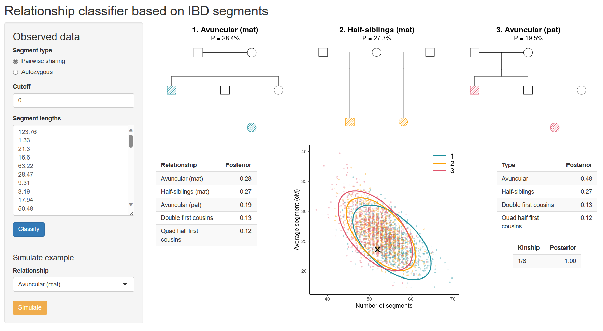

# ibdClassifier

***Try ibdClassifier here***:
<https://magnusdv.shinyapps.io/ibdClassifier>.

  

## What is ibdClassifier?

**ibdClassifier** is a tool for predicting a pairwise relationship based
on a set of IBD segments. It implements a Bayes classifier using the
number of segments and their lengths.

### Note: Still under development

***ibdClassifier** is an experimental app currently under development.
It is not yet ready to be used in critical real-world applications.*
