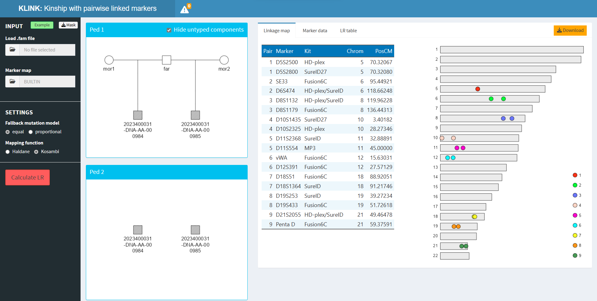

# KLINK - kinship with linked markers



  

***Try KLINK here***: <https://magnusdv.shinyapps.io/klink>.

  

## What is KLINK?

KLINK is a user-friendly app extending the
[Familias](https://familias.no/) software for kinship calculations in
forensic genetics. Unlike Familias, KLINK allows pairs of linked
markers, which are often seen in modern marker kits.

While KLINK has substantial overlap with the Familias companion
[FamLink](https://www.famlink.se/), it offers several unique features:

- platform independent (not only Windows)
- visualisations of pedigrees and marker maps
- ready-to-use output reports in Excel format

It should be noted that KLINK currently only handles *pairs* of linked
markers. For more general linkage, e.g. with dense SNPs, we recommend
FamLink.

## Running KLINK

KLINK is available both as an online app and as an R package. The latter
is important if you have sensitive data and want to run everything
locally. To set this up, simply install from CRAN with

``` r
install.packages("KLINK")
```

You can then open KLINK with the command

``` r
KLINK::launchApp()
```
