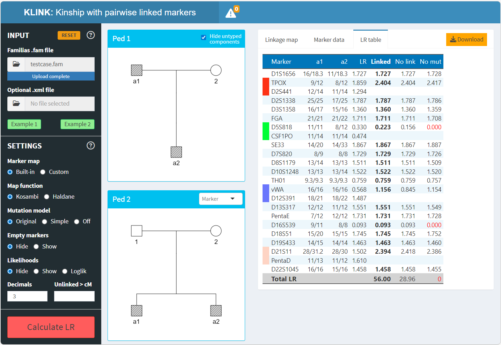

# KLINK: Kinship testing with pairwise linked markers



  

***Try KLINK online here***: <https://magnusdv.shinyapps.io/klink>.

  

***NEWS 2026**: Check out the [KLINK
paper](https://doi.org/10.1016/j.fsigen.2026.103578) in FSI:Genetics!*

  

## What is KLINK?

KLINK is a free, user-friendly app extending the
[Familias](https://familias.no/) software for kinship calculations in
forensic genetics. Unlike Familias, KLINK has the ability to model
linkage between markers. This is increasingly important in modern
forensic kinship testing, which often involves combinations of multiple
STR kits to increase statistical power.

A paper describing KLINK in detail is available here: [KLINK: A program
for kinship testing with pairwise linked STR
markers](https://doi.org/10.1016/j.fsigen.2026.103578) (Vigeland and
Gilfillan, 2026).

While KLINK has substantial overlap with the Familias companion
[FamLink](https://www.famlink.se/), it offers several unique features:

- advanced mutation modelling
- visualisations of pedigrees and marker maps
- platform independent (not only Windows)
- ready-to-use output reports in Excel format

It should be noted that KLINK currently only models *pairwise* linkage.
If more than two markers are on the same chromosome, the program groups
them into pairs (always choosing the closest ones) but ignores linkage
between different pairs. As shown in the paper, this procedure gives
robust LR calculations in typical applications combining several STR
kits. when the number of markers is not too high. For general linkage,
e.g. with dense SNPs, we recommend FamLink.

## Running KLINK

KLINK is available both as an online app (see link above) and as an R
package. The latter is important if you have sensitive data and want to
do the analysis locally/offline. To set this up, install it in R with

``` r

install.packages("KLINK")
```

The following command then opens the KLINK program:

``` r

KLINK::launchApp()
```

## Linkage Lab

The [Linkage
Lab](https://magnusdv.github.io/pedsuite/articles/web_only/linkagelab.html)
is a companion app to KLINK, which allows you to explore the effects of
linkage on kinship calculations. It is freely available online here:
<https://magnusdv.shinyapps.io/linkagelab>.
