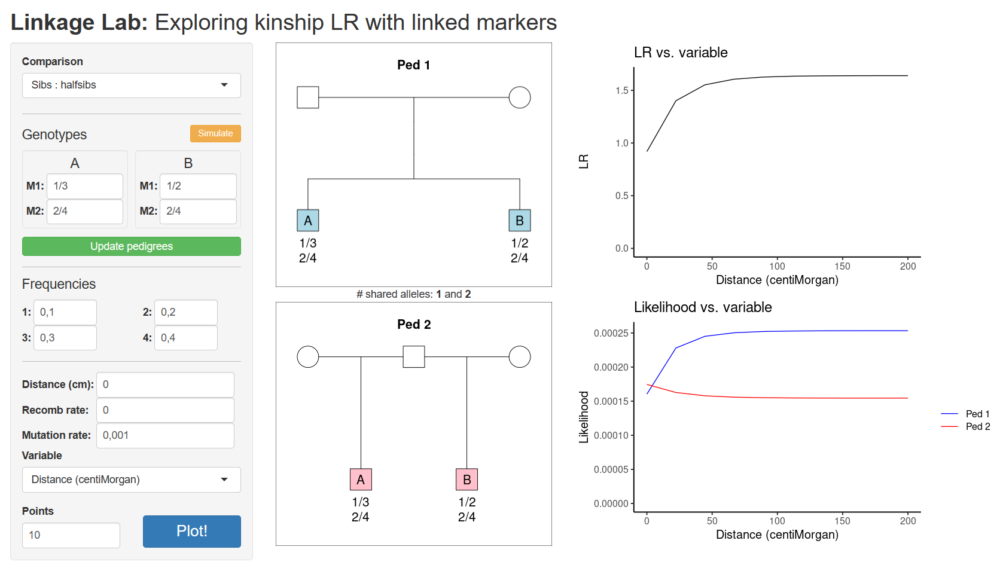

# LinkageLab - playing with linked markers

  

***Try LinkageLab here***: <https://magnusdv.shinyapps.io/linkagelab>.

  

## What is LinkageLab?

LinkageLab is a pedagogical tool for understanding how marker linkage
affects likelihood ratios (LRs) in kinship testing.
