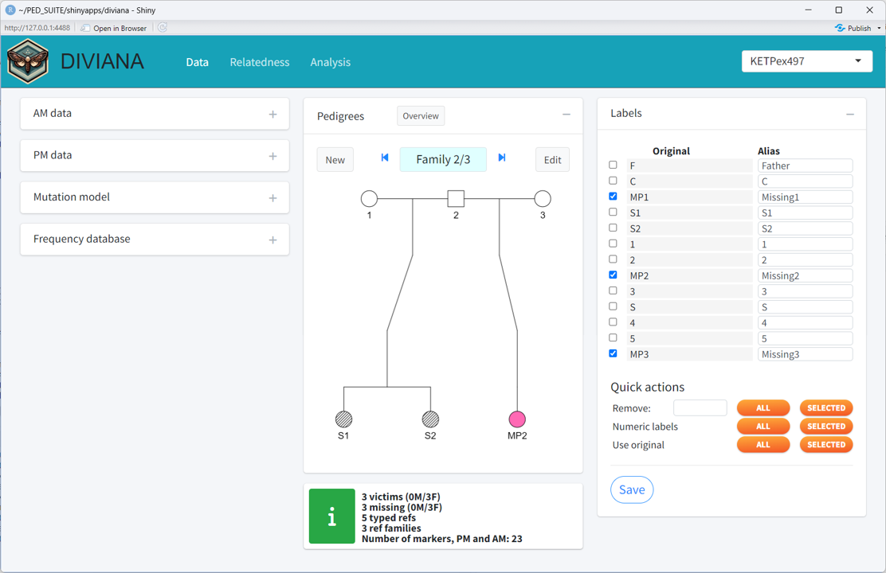

```{r setup, include=FALSE}
knitr::opts_chunk$set(echo = FALSE, 
                      fig.align = "center",
                      dpi = 300,
                      collapse = TRUE,
                      comment = "#>")
```

<!-- avoid border around images -->
<style>
    img {border: 0;}
</style>

```{r square, out.width = "99%"}

```

<br>

::: { .greeting .message style="color: red; font-size: large;"}
**_Source code here_**: https://github.com/magnusdv/diviana.
:::

<br>

## What is DIVIANA?
DIVIANA is a user-friendly app for *disaster victim identification* (DVI).
