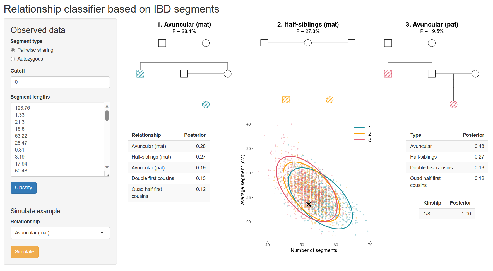

```{r setup, include=FALSE}
knitr::opts_chunk$set(echo = FALSE, 
                      fig.align = "center",
                      dpi = 300,
                      collapse = TRUE,
                      comment = "#>")
```

<!-- avoid border around images -->
<style>
    img {border: 0;}
</style>

```{r square, out.width = "100%"}

```

::: { .greeting .message style="color: red; font-size: large;"}
**_Try ibdClassifier here_**: https://magnusdv.shinyapps.io/ibdClassifier.
:::

<br>

## What is ibdClassifier?
**ibdClassifier** is a tool for predicting a pairwise relationship based on a set of IBD segments. It implements a Bayes classifier using the number of segments and their lengths.

### Note: Still under development
_**ibdClassifier** is an experimental app currently under development. It is not yet ready to be used in critical real-world applications._
