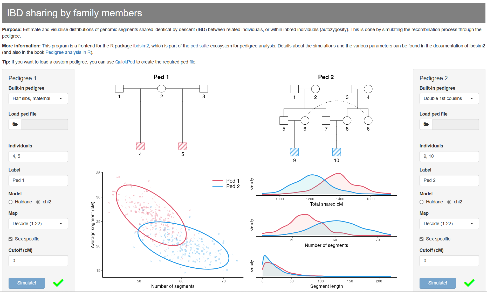

```{r setup, include=FALSE}
knitr::opts_chunk$set(echo = FALSE, 
                      fig.align = "center",
                      dpi = 300,
                      collapse = TRUE,
                      comment = "#>")
```

<!-- avoid border around images -->
<style>
    img {border: 0;}
</style>

```{r square, out.width = "100%"}

```

::: { .greeting .message style="color: red; font-size: large;"}
**_Try ibdsim2-shiny here_**: https://magnusdv.shinyapps.io/ibdsim2-shiny.
:::

<br>

## What is ibdsim2-shiny?
An online tool for visualising and comparing distributions of IBD-sharing between pedigree members.
