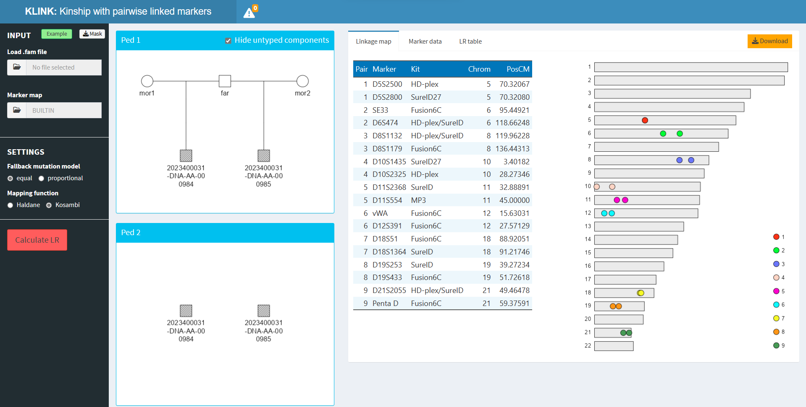

```{r setup, include=FALSE}
knitr::opts_chunk$set(echo = FALSE, 
                      fig.align = "center",
                      dpi = 300,
                      collapse = TRUE,
                      comment = "#>")
```

<!-- avoid border around images -->
<style>
    img {border: 0;}
</style>

```{r square, out.width = "99%"}

```

<br>

::: { .greeting .message style="color: red; font-size: large;"}
**_Try KLINK here_**: https://magnusdv.shinyapps.io/klink.
:::

<br>

## What is KLINK?
KLINK is a user-friendly app extending the [Familias](https://familias.no/) software for kinship calculations in forensic genetics. Unlike Familias, KLINK allows pairs of linked markers, which are often seen in modern marker kits.

While KLINK has substantial overlap with the Familias companion [FamLink](https://www.famlink.se/), it offers several unique features:

* platform independent (not only Windows)
* visualisations of pedigrees and marker maps
* ready-to-use output reports in Excel format

It should be noted that KLINK currently only handles *pairs* of linked markers. For more general linkage, e.g. with dense SNPs, we recommend FamLink.

## Running KLINK
KLINK is available both as an online app and as an R package. The latter is important if you have sensitive data and want to run everything locally. To set this up, simply install from CRAN with

```{r, echo = TRUE, eval = FALSE}
install.packages("KLINK")
```

You can then open KLINK with the command
```{r, echo = TRUE, eval = FALSE}
KLINK::launchApp()
```
