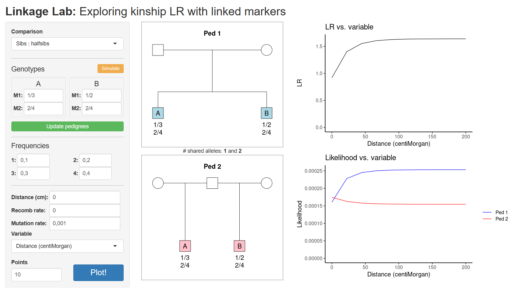

```{r setup, include=FALSE}
knitr::opts_chunk$set(echo = FALSE, 
                      fig.align = "center",
                      dpi = 300,
                      collapse = TRUE,
                      comment = "#>")
```

<!-- avoid border around images -->
<style>
    img {border: 0;}
</style>

```{r square, out.width = "99%"}

```

<br>

::: { .greeting .message style="color: red; font-size: large;"}
**_Try LinkageLab here_**: https://magnusdv.shinyapps.io/linkagelab.
:::

<br>

## What is LinkageLab?
LinkageLab is a pedagogical tool for understanding how marker linkage affects likelihood ratios (LRs) in kinship testing.
