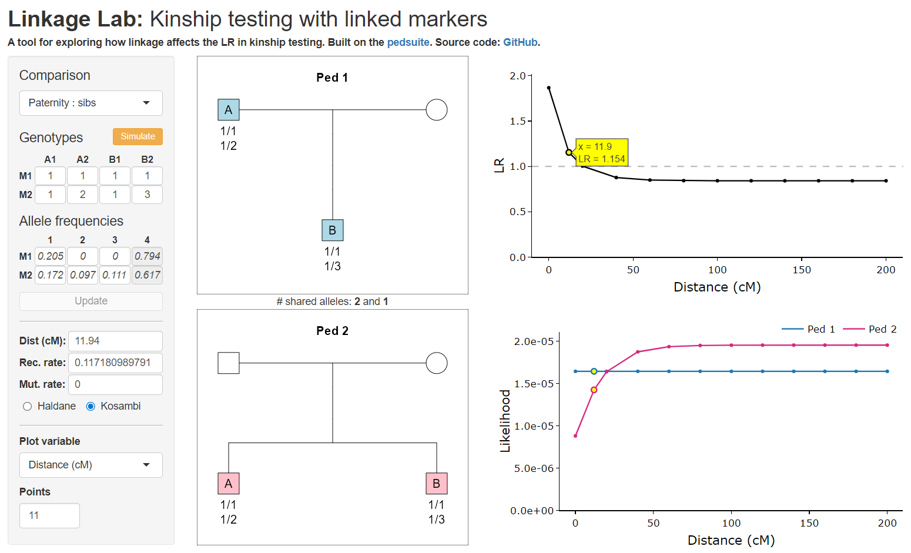

```{r setup, include=FALSE}
knitr::opts_chunk$set(echo = FALSE, 
                      fig.align = "center",
                      dpi = 300,
                      collapse = TRUE,
                      comment = "#>")
```

<!-- avoid border around images -->
<style>
    img {border: 0;}
</style>

```{r square, out.width = "99%"}

```

<br>

::: { .greeting .message style="color: red; font-size: large;"}
**_Try Linkage Lab here_**: https://magnusdv.shinyapps.io/linkagelab.
:::

<br>

## What is Linkage Lab?
Linkage Lab is a pedagogical tool for exploring and understanding how marker linkage affects likelihood ratios (LRs) in kinship testing. It is a companion to [KLINK](https://magnusdv.github.io/pedsuite/articles/web_only/klink.html), which is a full-featured software for kinship testing, including support for linkage.

Linkage Lab is described in detail in the KLINK paper: [KLINK: A program for kinship testing with pairwise linked STR markers](https://doi.org/10.1016/j.fsigen.2026.103578) (Vigeland and Gilfillan, 2026).
