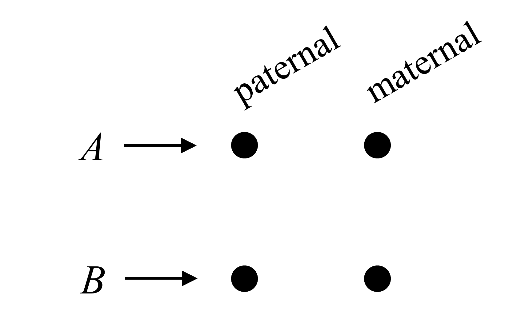
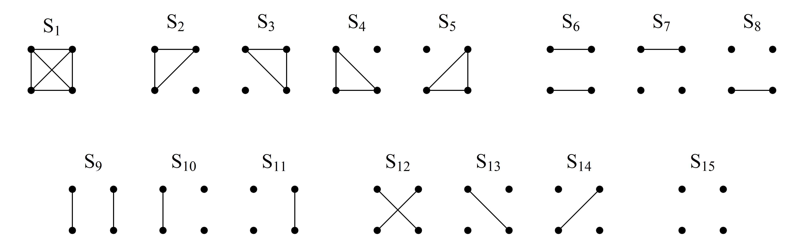
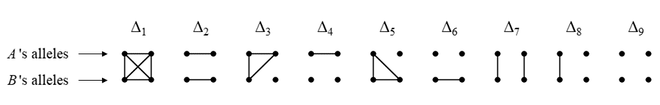
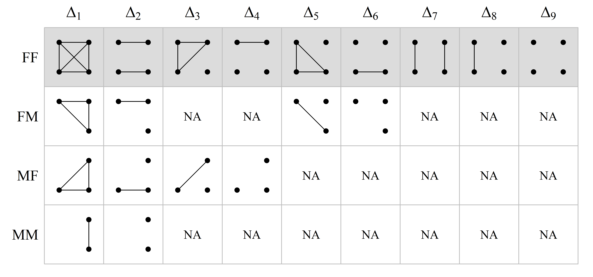
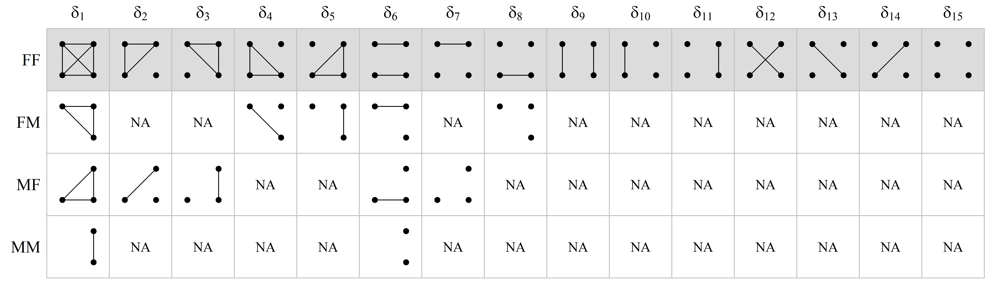

```{r setup, include=FALSE}
knitr::opts_chunk$set(echo = FALSE, 
                      fig.align = "center",
                      dpi = 300,
                      collapse = TRUE,
                      comment = "#>")
```

<!-- avoid border around images -->
<style>
    img {border: 0;}
</style>

::: { .greeting .message style="color: red; font-size: large;"}
**_Try QuickPed here_**: https://magnusdv.shinyapps.io/quickped.
:::

::: { .greeting .message style="color: orange; font-size: large;"}
**_Paper in BMC Bioinformatics_**: https://doi.org/10.1186/s12859-022-04759-y. 
:::

<br>

# What is QuickPed?
QuickPed is an interactive web application for drawing and analysing pedigrees. A created pedigree may be saved as an image or as a text file in *ped format* (see [below](#ped-files)). You may also obtain various information about the pedigree, including relatedness coefficients and verbal descriptions of relationships.

QuickPed is powered by the [pedsuite](https://magnusdv.github.io/pedsuite/) and uses [kinship2](https://CRAN.R-project.org/package=kinship2) for alignment calculations. 
The web app was built with Shiny.


# Drawing pedigrees
Creating pedigrees with QuickPed is very intuitive: Select a suitable start pedigree and modify it as needed. You may also load an existing ped file (see below). Modifications are done by clicking on one or several individuals and then applying appropriate buttons, for instance to add children, siblings or parents. At any time you may change attributes like sex, affection status, twin status and ID labels. 

## Tips and tricks

* __Selecting individuals__. Select/deselect pedigree members by clicking on them. Selected individuals are shown in red colour. Time-saving tip: To deselect everyone, click on the hand pointer with a red strikethrough.

* __Adding parents__. If you select a single founder and click "Add Parents," new parents will be created for this individual. From version 4.1.1, you can also assign _existing_ members as parents. First, select the child, then the intended parent(s) — the order of selection matters! Finally, click "Add Parents."

* __Removing individuals__. When removing pedigree members you must decide whether you want to remove *downwards* or *upwards*. For example, in the pedigree below, if you want to end up with the trio 1-2-3, select 4 and/or 5 and delete downwards with `↓`. Conversely, if you want the trio 3-4-5, then select 1 and/or 2, and click `↑`.
    ```{r, echo = F, fig.height = 2.5, fig.width = 2.5, out.width = "32%"}
    plot(pedtools::linearPed(2), margins = c(.2,1,1,1),
         col = list(blue = 1:2, red = 4:5), 
         textInside = c("1" = "↑", "2" = "↑", "4" = "↓", "5" = "↓"), 
         lwd = list("2" = c(1,2,4,5)))
    ```
    *Note: In both cases, leftover founder-spouses are automatically removed.*

* __Automatic labelling__. Automatic labelling of the pedigree members are available in two different formats. The button marked `1,2,..` applies numeric labels to all individuals, in the order of their appearance in the pedigree plot. Alternatively, the `I-1, I-2,..` button numbers the members generation-wise, using Roman numerals to indicate the generation number. 

* __Line breaks in labels__. By default, pedigree labels are folded automatically to width approximately 12 characters. To insert hard line breaks, use a double space. For instance, if you want "King Lear" to appear on two lines, modify the label to "King`r knitr::asis_output("\U2423\U2423")`Lear", i.e., with two spaces between the words.

* __Text annotation__. Double clicking on a pedigree member opens a popup window, in which text may be added around and inside the symbol for this individual.

* __Plot settings__. If the pedigree gets too large, increase the plot region using the control panel on the far right. Here you may also adjust the margins, the size of pedigree symbols and text labels.

* __R code__. The "R code" button, located on the right side of QuickPed, opens a text window containing R code that reproduces the current pedigree plot. By saving this to a .R file, or simply copy-pasting the code into R, you can explore further plot options (see `?pedtools::plot.ped` for lots of examples!) or use the pedigree as starting point for analysis with the **pedsuite**.

## Built-in pedigrees
In the left-most panel of QuickPed the user may choose among a selection of standard pedigrees, including trios, full/half siblings, avuncular and cousin pedigrees of different kinds. Also included are a variety of more complex pedigree structures like double cousins and quad half first cousins. 

Finally, the following historic pedigrees are available:

* __Habsburg__: A subset of the infamously inbred family tree of the Habsburg royalties. The inbreeding coefficient of King Charles II of Spain (1661-1700) was approximately 0.25, i.e., equivalent to that of a child produced by full siblings. Pedigree adapted from [Wikipedia](https://en.wikipedia.org/wiki/Habsburg_family_tree). See also [The Role of Inbreeding in the Extinction of a European Royal Dynasty](https://doi.org/10.1371/journal.pone.0005174).

* __Jicaque__: A pedigree of Jicaque Indians originally studied by Chapman & Jacquard (1971) and subsequently used in many papers on relatedness and pedigree coefficients.

* __Queen Victoria (haemophilia)__: The royal family tree descending from Queen Victoria, showing the X-linked inheritance of *haemophilia*. Adapted from Figure S1 of [Genotype Analysis Identifies the Cause of the “Royal Disease"](https://doi.org/10.1126/science.1180660).

* __Tutankhamun__: The family tree of the Egyptian pharaoh Tutankhamun, as inferred from genetic evidence presented by Hawass et al. (2010), [Ancestry and Pathology in King Tutankhamun's Family](https://doi.org/10.1001/jama.2010.121).

# Ped files
A useful feature of QuickPed is to produce text files describing pedigrees in so-called *ped format*. Such files are often required by software for pedigree analysis.

For a simple illustration, consider this pedigree:

```{r trio-ped, echo = F, fig.height = 2, fig.width = 2.2, out.width = "30%"}
df = data.frame(id = 1:3, fid = c(0,0,1), mid = c(0,0,2), sex = c(1,2,2), aff = c(1,1,2))
x = pedtools::as.ped(df[1:4])
plot(x, aff = which(df$aff == 2), margins = 0.5)
```

A text file describing this pedigree may contain the following.

```{r, echo = F, comment = NA}
print(df, row.names = F)
```

The columns are:

* `id`: Individual ID
* `fid`: Father's ID (or 0 if not included in the pedigree)
* `mid`: Mother's ID (or 0 if not included in the pedigree)
* `sex`: Sex (1 = male; 2 = female; 0 = unknown)
* `aff`: Affection status (1 = unaffected; 2 = affected; 0 = unknown)

It should be noted that the ped format is not completely standardised, and different software may use slightly different versions. For example, a first column with *Family ID* is sometimes required. Also, the `aff` column may not be needed in non-medical applications. These and other details may be specified when using QuickPed.

Some pedigree information may be shown on the plot, but is *not* stored in the ped file. In the current version of QuickPed, this includes twin relationships, carrier status and deceased status.


# Relatedness analysis

## Overview
Under `Relationships` there are four buttons offering different analyses of relationships within the loaded pedigree. The buttons are, in order:

* __Describe relationship__. Prints a standardised description of the relationship between two selected individuals. The text is generated by [verbalisr](https://github.com/magnusdv/verbalisr).
 
* __Calculate coefficients__. Prints the most important relatedness coefficients between two selected individuals:
  * The inbreeding coefficient of each individual.
  * The kinship coefficient $\varphi$.
  * The degree of relationship.
  * The IBD coefficients $\kappa = (\kappa_0, \kappa_1, \kappa_2)$, if both individuals are non-inbred.
  * The condensed identity coefficients $\Delta = (\Delta_1, ..., \Delta_9)$, if either individual is inbred.

* __Relatedness triangle__. Produces a plot representing the IBD coefficients $\kappa$ as a point in a *relatedness triangle*. Requires two noninbred individuals to be selected.

* __Table of coefficients__. Activates a popup window where the user can choose among a variety of coefficients, including detailed identity and X-chromosomal coefficients, to be computed for each pair of pedigree members. Generates a tab-separated file for download.


## Coefficients of relatedness
QuickPed calculates a variety of different relatedness coefficients, which we briefly review here for convenience. For more details we recommend e.g. Thompson's book *Statistical Inference from Genetic Data on Pedigrees* or Lange's book *Mathematical and Statistical Methods for Genetic Analysis*. 

For a given pedigree with members $A$ and $B$ we define the following:

* The inbreeding coefficient $f$ of individual $A$ is the kinship coefficient (see below) of the parents of $A$, or 0 if $A$ is a founder of the pedigree.
* The kinship coefficient $\varphi$ between $A$ and $B$ is the probability that a random allele from $A$ and a random allele from $B$ at the same locus, are *identical by descent* (IBD), i.e., that they have the same ancestral origin within the pedigree.
* The IBD coefficients $\kappa = (\kappa_0, \kappa_1, \kappa_2)$ between $A$ and $B$, are the probabilities of sharing respectively 0, 1, or 2 alleles IBD at a random locus. Defined for noninbred individuals only.
* The *condensed identity coefficients* $\Delta = (\Delta_1, \dots, \Delta_9)$ between $A$ and $B$, are the expected relative frequencies of the 9 condensed IBD states (see below) of the four homologue alleles at an autosomal locus.
* The *detailed identity coefficients* $\delta = (\delta_1, \dots, \delta_{15})$  are the expected relative frequencies of the 15 detailed IBD states (see below).


## A brief recap of identity states
Following Jacquard (1974) and subsequent authors, the 4 alleles carried by individuals $A$ and $B$ at an autosomal locus, can be drawn as dots in a square diagram:

```{r square, out.width = "40%"}

```

An *identity state* is a pattern of IBD between the alleles, represented by line segments connecting the alleles.

### Detailed states
In total there are 15 possible patterns of IBD between 4 alleles. These are called the *detailed identity states*, and are shown below in the order used by QuickPed.

```{r detailed, out.width = "100%"}

```

### Condensed states
In most applications the paternal/maternal origin of alleles does not matter. The 15 detailed states are then reduced to 9, known as the *condensed identity states*:

```{r condensed, out.width="100%"}

```

## X-chromosomal identity coefficients
X-chromosomal identity states and their coefficients are less studied than the autosomal ones, and there are fewer conventions regarding their order and how to draw them. The presentation here does not claim superiority over others; its main purpose is to act as a reference for understanding the output of QuickPed.

As in the autosomal case, the identity coefficients on X are the expected proportions of the possible IBD states involving the alleles at a random locus (on X). The challenge is that the set of states depends on the sex of the two individuals: F/F, F/M, M/F or M/M (where F = female and M = male). 

Males are *hemizygous* on X, with only one allele at each locus (except in a few so-called *pseudo-autosomal regions*, which we ignore here). Hence, for pairs of individuals including a male, the total number of alleles is less than 4. However, to avoid having to memorise new states for each sex combination, we may re-use the autosomal pictograms by invoking a simple rule: Given an X-chromosomal identity state, **replace any hemizygous allele with a pair of autozygous alleles**. 
This rule guides the following table, which shows how to interpret the condensed X-chromosomal coefficients returned by QuickPed. The first row, corresponding to two females, is identical to the autosomal case.

```{r condensed-X, out.width="100%"}

```

In a similar fashion, the states corresponding to the *detailed* X-chromosomal coefficients, are as follows:

```{r detailed-X, out.width="100%"}

```

Note that for hemizygous males, the single allele is drawn on the right side, since it is maternally inherited. It should also be noted that QuickPed always outputs the same number of coefficients (9 condensed; 15 detailed), regardless of sex, but with NAs in all positions corresponding to undefined states.
